学习目标 

- MyBatis介绍
- MyBatis入门案例
- 自定义MyBatis
- MyBatis的CRUD
- MyBatis的原始Dao开发
- MyBatis的ORM映射
- MyBatis的配置文件
- MyBatis的关联查询
- MyBatis的延迟加载
- MyBatis的动态SQL
- MyBatis的缓存
- MyBatis的注解开发

# 1.MyBatis介绍

## 1.1.什么是框架

​		框架(framework)是一个半成品，已经对基础的代码进行了封装并提供相应的API，开发者在使用框架是直接调用封装好的api可以省去很多代码编写，从而提高工作效率和开发速度。

​		简单说就是使用别人搭好的舞台，你来做表演。而且，框架一般是成熟的，不断升级的软件。

## 1.2.框架要解决的问题

框架要解决的最重要的一个问题是技术整合的问题，在 J2EE 的 框架中，有着各种各样的技术，不同的 软件企业需要从 J2EE 中选择不同的技术，这就使得软件企业最终的应用依赖于这些技术，技术自身的复杂性和技 术的风险性将会直接对应用造成冲击。而应用是软件企业的核心，是竞争力的关键所在，因此应该将应用自身的设 计和具体的实现技术解耦。这样，软件企业的研发将集中在应用的设计上，而不是具体的技术实现，技术实现是应 用的底层支撑，它不应该直接对应用产生影响。

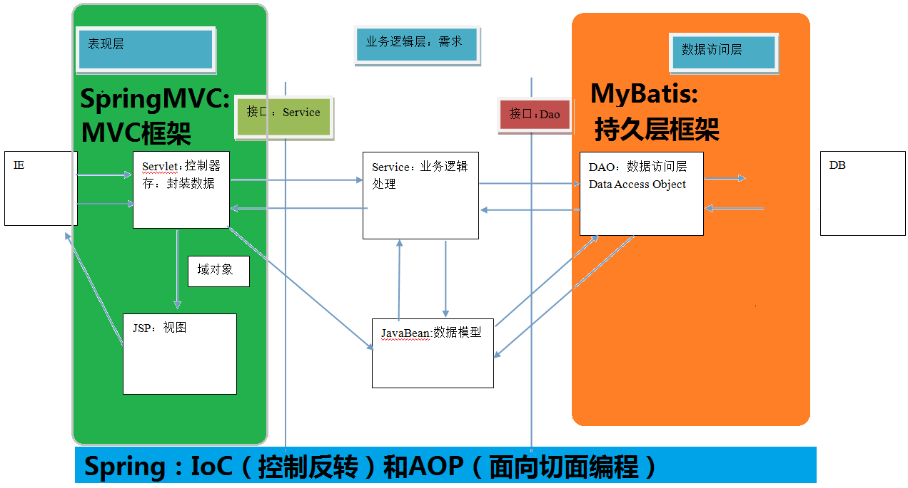

## 1.3.传统Jdbc代码问题分析

- 传统Jdbc程序

  ```java
  public class JdbcTest {
      public static void main(String[] args) {
          try {
              //1.加载数据库驱动
              Class.forName("com.mysql.jdbc.Driver");
              //2.创建连接对象
              String url = "jdbc:mysql://192.168.10.137:3306/ssm";
              Connection connection = DriverManager.getConnection(url, 
                                                                  "root",
                                                                  "1111");
              String sql = "select * from account";
              //3.准备PreparedStatement对象
              PreparedStatement pst = connection.prepareStatement(sql);
              //4.执行sql语句
              ResultSet rs = pst.executeQuery();
              //5.遍历结果集
              while(rs.next()){
                  Integer id = rs.getInt("id");
                  String name = rs.getString("name");
                  Double money = rs.getDouble("money");
                  System.out.println(id + " " + name + " " + money);
              }
              //6.关闭资源
              rs.close();
              pst.close();
              connection.close();
          } catch (Exception e) {
              e.printStackTrace();
          }
      }
  }
  ```

- 问题

  1. 手动创建和释放链接

  2. sql语句在代码中硬编码

  4. 对结果集解析存在硬编码

## 1.4.MyBatis框架概述

	

​		MyBatis 本是[apache](http://baike.baidu.com/view/28283.htm)的一个开源项目[iBatis](http://baike.baidu.com/view/628102.htm), 2010年这个项目由apache software foundation 迁移到了google code，并且改名为MyBatis，实质上Mybatis对ibatis进行一些改进。 

​		MyBatis是一个优秀的持久层框架，它对jdbc的操作数据库的过程进行封装，使开发者只需要关注 SQL 本身，而不需要花费精力去处理例如注册驱动、创建connection、创建statement、手动设置参数、获取结果集等jdbc繁杂的过程代码。

# 2.MyBatis入门案例

资料准备：在我们mybatis课程的学习中，我们会用到一些数据表和对应的sql语句，参考：资料/mybatis.sql

## 2.1.pom.xml

```xml
<?xml version="1.0" encoding="UTF-8"?>
<project xmlns="http://maven.apache.org/POM/4.0.0"
         xmlns:xsi="http://www.w3.org/2001/XMLSchema-instance"
         xsi:schemaLocation="http://maven.apache.org/POM/4.0.0 http://maven.apache.org/xsd/maven-4.0.0.xsd">
    <modelVersion>4.0.0</modelVersion>

    <groupId>com.qf</groupId>
    <artifactId>01_mybatis_HelloWorld</artifactId>
    <version>1.0-SNAPSHOT</version>

    <dependencies>
        <dependency>
            <groupId>org.mybatis</groupId>
            <artifactId>mybatis</artifactId>
            <version>3.4.5</version>
        </dependency>
        <dependency>
            <groupId>mysql</groupId>
            <artifactId>mysql-connector-java</artifactId>
            <version>5.1.47</version>
        </dependency>
        <dependency>
            <groupId>log4j</groupId>
            <artifactId>log4j</artifactId>
            <version>1.2.17</version>
        </dependency>
        <dependency>
            <groupId>junit</groupId>
            <artifactId>junit</artifactId>
            <version>4.12</version>
        </dependency>
    </dependencies>
    <build>
        <!-- 如果不添加此节点src/main/java目录下的所有配置文件都会被漏掉。 -->
        <resources>
            <resource>
                <directory>src/main/java</directory>
                <includes>
                    <include>**/*.xml</include>
                </includes>
            </resource>
        </resources>
    </build>
</project>
```

## 2.2.log4j.properties

```properties
# Global logging configuration
log4j.rootLogger=DEBUG, stdout
# Console output...
log4j.appender.stdout=org.apache.log4j.ConsoleAppender
log4j.appender.stdout.layout=org.apache.log4j.PatternLayout
log4j.appender.stdout.layout.ConversionPattern=%5p [%t] - %m%n
```

## 2.3.pojo

```java
public class User implements Serializable {
    private Integer id;
    private String username;
    private Date birthday;
    private String sex;
    private String address;

    public Integer getId() {
        return id;
    }

    public void setId(Integer id) {
        this.id = id;
    }

    public String getUsername() {
        return username;
    }

    public void setUsername(String username) {
        this.username = username;
    }

    public Date getBirthday() {
        return birthday;
    }

    public void setBirthday(Date birthday) {
        this.birthday = birthday;
    }

    public String getSex() {
        return sex;
    }

    public void setSex(String sex) {
        this.sex = sex;
    }

    public String getAddress() {
        return address;
    }

    public void setAddress(String address) {
        this.address = address;
    }

    @Override
    public String toString() {
        return "User{" +
                "id=" + id +
                ", username='" + username + '\'' +
                ", birthday=" + birthday +
                ", sex='" + sex + '\'' +
                ", address='" + address + '\'' +
                '}';
    }
}
```

## 2.4.UserDao

```java
public interface UserDao {
    public List<User> findAll();
}
```

## 2.5.UserDao.xml

```xml
<?xml version="1.0" encoding="UTF-8"?>
<!DOCTYPE mapper
        PUBLIC "-//mybatis.org//DTD Mapper 3.0//EN"
        "http://mybatis.org/dtd/mybatis-3-mapper.dtd">
<!--namespace：必须是接口名称的全类名-->
<mapper namespace="com.qf.dao.UserDao">
    <!--
      id:和接口方法名保持一致
      resultType:和接口返回类型保持一致
     -->
    <select id="findAll" resultType="com.qf.pojo.User">
        select * from user
    </select>
</mapper>
```

## 2.6.SqlMapConfig.xml

```xml
<?xml version="1.0" encoding="UTF-8"?>
<!DOCTYPE configuration PUBLIC "-//mybatis.org//DTD Config 3.0//EN" "http://mybatis.org/dtd/mybatis-3-config.dtd">
<configuration>
    <!-- 和spring整合后 environments配置将废除-->
    <environments default="mysql">
        <!-- 配置 mysql 的环境 -->
        <environment id="mysql">
            <!-- 配置事务的类型 -->
            <transactionManager type="JDBC"></transactionManager>
            <!-- 配置连接数据库的信息：用的是数据源(连接池) -->
            <dataSource type="POOLED">
                <property name="driver" value="com.mysql.jdbc.Driver"/>
                <property name="url" value="jdbc:mysql://127.0.0.1:3306/mybatis?
                                            			characterEncoding=UTF-8"/>
                <property name="username" value="root"/>
                <property name="password" value="1111"/>
            </dataSource>
        </environment>
    </environments>
    <!-- 告知 mybatis 映射配置的位置 -->
    <mappers>
        <mapper resource="com/qf/dao/UserDao.xml"/>
    </mappers>
</configuration>
```

## 2.7.测试

```java
public class MyBatisTest {

    private InputStream inputStream;
    private SqlSession sqlSession;

    @Before
    public void createSqlSession() throws IOException {
        // 加载配置文件
        String resource = "SqlMapConfig.xml";
        inputStream = Resources.getResourceAsStream(resource);

        // 创建SqlSessionFactory
        SqlSessionFactory sqlSessionFactory = 
            				new SqlSessionFactoryBuilder().build(inputStream);
        //获得数据库会话实例
        sqlSession = sqlSessionFactory.openSession();
    }

    @Test
    public void testFindAll(){
        UserDao userDao = sqlSession.getMapper(UserDao.class);
        List<User> userList = userDao.findAll();
        for(User user : userList) {
            System.out.println(user);
        }
    }

    @After
    public void closeSqlSession() throws IOException {
        sqlSession.close();
        inputStream.close();
    }
}
```

## 2.8.MyBatis运行原理

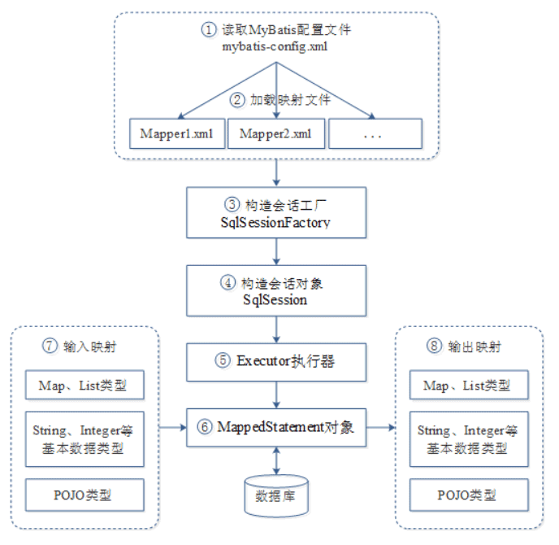	

MyBatis框架在操作数据库时，大体经过了8个步骤：

1. **读取MyBatis配置文件**mybatis-config.xml。mybatis-config.xml作为MyBatis的全局配置文件，配置了MyBatis的运行环境等信息，其中主要内容是获取数据库连接。

2. **加载映射文件**Mapper.xml。Mapper.xml文件即SQL映射文件，该文件中配置了操作数据库的SQL语句，需要在mybatis-config.xml中加载才能执行。mybatis-config.xml可以加载多个配置文件，每个配置文件对应数据库中的一张表。

3. **构建会话工厂**。通过MyBatis的环境等配置信息构建会话工厂SqlSessionFactory。

4. **创建SqlSession对象**。由会话工厂创建SqlSession对象，该对象中包含了执行SQL的所有方法。

5. MyBatis底层定义了一个**Executor接口来操作数据库**，它会根据SqlSession传递的参数动态的生成需要执行的SQL语句，同时负责查询缓存的维护。

6. 在Executor接口的执行方法中，包含一个MappedStatement类型的参数，该参数是对映射信息的封装，用来**存储要映射的SQL语句的id、参数、输出结果类型**等。Mapper.xml文件中一个SQL对应一个MappedStatement对象，SQL的id即是MappedStatement的id。

7. **输入参数映射**。在执行方法时，MappedStatement对象会对用户执行SQL语句的输入参数进行定义(可以定义为Map、List类型、基本类型和POJO类型)，Executor执行器会通过MappedStatement对象在执行SQL前，将输入的Java对象映射到SQL语句中。这里对输入参数的映射过程就类似于JDBC编程中对preparedStatement对象设置参数的过程。

8. **输出结果映射**。在数据库中执行完SQL语句后，MappedStatement对象会对SQL执行输出的结果进行定义(可以定义为Map和List类型、基本类型、POJO类型)，Executor执行器会通过MappedStatement对象在执行SQL语句后，将输出结果映射至Java对象中。这种将输出结果映射到Java对象的过程就类似于JDBC编程中对结果的解析处理过程。	

# 3.自定义MyBatis

创建工程：

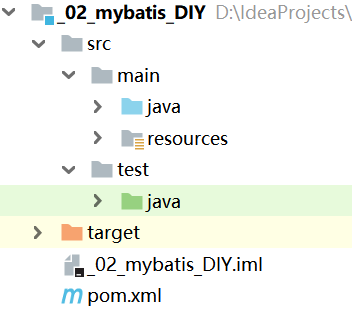	

## 3.1.MyBatis的核心对象

我们已经通过案例体验到了mybatis的魅力。现在来梳理一下MyBatis运行时的几个对象，我们需要搞清楚他们的作用，进而需要理解mybatis的整个工作流程和执行原理。

- Resources

  加载配置文件，有一种是使用类加载进行加载，我们通过这个类的类加载器进行资源的加载。

- SqlSessionFactoryBuilder

  构建SqlSessionFactory工厂对象需要的对象。采用了**构建者模式**，屏蔽了对象构建的细节。

- SqlSessionFactory

  创建SqlSession对象所用。使用**工厂模式**创建，目的就是解耦合。

- SqlSession

  创建代理对象，使用了**代理模式**。

- Executor

  操作数据库

- MappedStatement

  存储SQL语句、参数、输出结果类型

## 3.2.pom.xml

```xml
<?xml version="1.0" encoding="UTF-8"?>
<project xmlns="http://maven.apache.org/POM/4.0.0"
         xmlns:xsi="http://www.w3.org/2001/XMLSchema-instance"
         xsi:schemaLocation="http://maven.apache.org/POM/4.0.0 http://maven.apache.org/xsd/maven-4.0.0.xsd">
    <modelVersion>4.0.0</modelVersion>

    <groupId>com.qf</groupId>
    <artifactId>02_mybatis_DIY</artifactId>
    <version>1.0-SNAPSHOT</version>

    <dependencies>
        <dependency>
            <groupId>mysql</groupId>
            <artifactId>mysql-connector-java</artifactId>
            <version>5.1.47</version>
        </dependency>
        <dependency>
            <groupId>log4j</groupId>
            <artifactId>log4j</artifactId>
            <version>1.2.17</version>
        </dependency>
        <dependency>
            <groupId>junit</groupId>
            <artifactId>junit</artifactId>
            <version>4.12</version>
        </dependency>
        <!-- 解析xml的dom4j -->
        <dependency>
            <groupId>dom4j</groupId>
            <artifactId>dom4j</artifactId>
            <version>1.6.1</version>
        </dependency>
        <!-- dom4j的依赖包jaxen -->
        <dependency>
            <groupId>jaxen</groupId>
            <artifactId>jaxen</artifactId>
            <version>1.1.6</version>
        </dependency>
    </dependencies>
    <build>
        <!-- 如果不添加此节点src/main/java目录下的所有配置文件都会被漏掉。 -->
        <resources>
            <resource>
                <directory>src/main/java</directory>
                <includes>
                    <include>**/*.xml</include>
                </includes>
            </resource>
        </resources>
    </build>
</project>
```

## 3.3.utils

我们需要三个工具类：

- XMLConfigBuilder：解析XMl配置文件。
- DataSourceUtil：获取数据库连接对象。
- Executor：执行SQL，封装我们想要的数据。

参考：资料/utils

## 3.4.Resources

l编写资源加载类。使用类加载器加载配置文件

```java
package com.qf.io;

import java.io.InputStream;

public class Resources {
    //根据文件名称，加载类路径下面的配置文件
    public static InputStream getResourceAsStream(String filePath){
        return Resources.class.getClassLoader().getResourceAsStream(filePath);
    }
}
```

## 3.5.SqlSessionFactoryBuilder

将配置资源封装成Configuration对象，并且将该资源对象传到工厂对象中

```java
package com.qf.builder;

import com.qf.cfg.Configuration;
import com.qf.factory.DefaultSqlSessionFactory;
import com.qf.factory.SqlSessionFactory;
import com.qf.utils.XMLConfigBuilder;

import java.io.InputStream;

public class SqlSessionFactoryBuilder {

    /**
     * 构建SqlSessionFactory对象
     * @param in
     * @return
     */
    public SqlSessionFactory build(InputStream in){
        Configuration configuration = XMLConfigBuilder.loadConfiguration(in);
        return  new DefaultSqlSessionFactory(configuration);
    }
}
```

## 3.6.Configuration

配置类存储所有的配置信息

```java
package com.qf.cfg;

import com.qf.mapping.MappedStatement;

import java.util.HashMap;
import java.util.Map;

public class Configuration {

    private String driver;
    private String url;
    private String username;
    private String password;

    private Map<String, MappedStatement> mappers = new HashMap<String,MappedStatement>();

    public Map<String, MappedStatement> getMappers() {
        return mappers;
    }

    public void setMappers(Map<String, MappedStatement> mappers) {
        this.mappers.putAll(mappers);//此处需要使用追加的方式
    }

    public String getDriver() {
        return driver;
    }

    public void setDriver(String driver) {
        this.driver = driver;
    }

    public String getUrl() {
        return url;
    }

    public void setUrl(String url) {
        this.url = url;
    }

    public String getUsername() {
        return username;
    }

    public void setUsername(String username) {
        this.username = username;
    }

    public String getPassword() {
        return password;
    }

    public void setPassword(String password) {
        this.password = password;
    }
}
```

## 3.7.MappedStatement

MappedStatement是用来封装sql语句和查询结果集

```java
package com.qf.mapping;

public class MappedStatement {

    private String queryString;//SQL
    private String resultType;//实体类的全限定类名

    public String getQueryString() {
        return queryString;
    }

    public void setQueryString(String queryString) {
        this.queryString = queryString;
    }

    public String getResultType() {
        return resultType;
    }

    public void setResultType(String resultType) {
        this.resultType = resultType;
    }
}
```

## 3.8.SqlSessionFactory

```java
public interface SqlSessionFactory {
    //获取SQLSession对象
    public SqlSession openSession();
}
```

```java
package com.qf.factory;

import com.qf.cfg.Configuration;
import com.qf.session.DefaultSqlSession;
import com.qf.session.SqlSession;

public class DefaultSqlSessionFactory implements SqlSessionFactory {

    private Configuration cfg;

    public DefaultSqlSessionFactory(Configuration cfg) {
        this.cfg = cfg;
    }

    /**
     * 获取一个SqlSession对象
     * @return
     */
    @Override
    public SqlSession openSession() {
        return new DefaultSqlSession(cfg);
    }
}
```

## 3.9.SqlSession

```java
public interface SqlSession {
    //获取代理对象
    public <T> T getMapper(Class<T> tClass);
     //释放资源
    void close();
}
```

```java
package com.qf.session;

import com.qf.utils.DataSourceUtil;
import com.qf.cfg.Configuration;

import java.lang.reflect.Proxy;
import java.sql.Connection;
import java.sql.SQLException;

public class DefaultSqlSession implements SqlSession {

    private Configuration cfg;
    private Connection conn;

    public DefaultSqlSession(Configuration cgf){
        this.cfg = cgf;
        this.conn = DataSourceUtil.getConnection(cfg);
    }


    /*
    * 创建代理对象
    */
    @Override
    public <T> T getMapper(Class<T> tClass) {
        /**
         * tClass.getClassLoader()：类加载器
         * new Class[]{tClass}：Class数组，让代理对象和被代理对象有相同的行为
         *  new ProxyFactory：增强的逻辑
         */
        return (T) Proxy.newProxyInstance(tClass.getClassLoader(),
                new Class[]{tClass},
                new ProxyFactory(cfg.getMappers(),conn));
    }

    @Override
    public void close() {
        try {
            conn.close();
        } catch (SQLException e) {
            e.printStackTrace();
        }
    }
}
```

## 3.10.ProxyFactory

```java
package com.qf.session;

import com.qf.mapping.MappedStatement;
import com.qf.utils.Executor;

import java.lang.reflect.InvocationHandler;
import java.lang.reflect.Method;
import java.sql.Connection;
import java.util.Map;

public class ProxyFactory implements InvocationHandler {

    private Map<String, MappedStatement> mappers;
    private Connection conn;
    public ProxyFactory(Map<String, MappedStatement> mappers, Connection conn){
       this.mappers = mappers;
       this.conn = conn;
    }
    //调用代理对象的任何方法，都会在这执行
    public Object invoke(Object proxy, Method method, Object[] args) throws Throwable {
        //1.获取方法名
        String methodName = method.getName();
        //2.获取方法所在类的名称
        String className = method.getDeclaringClass().getName();
        //3.组合key
        String key = className+"."+methodName;
        //4.获取mappers中的Mapper对象
        MappedStatement mappedStatement = mappers.get(key);
        //5.判断是否有mapper
        if(mappedStatement == null){
            throw new IllegalArgumentException("传入的参数有误");
        }
        //6.调用工具类执行查询所有
        return new Executor().selectList(mappedStatement,conn);
    }
}
```

## 3.11.测试

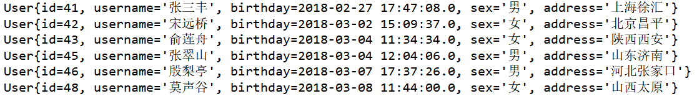

# 4.MyBatis的CRUD

创建工程：

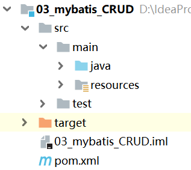		

## 4.1.查询

### 4.1.1.单个参数绑定

```java
    //单个参数传递
    public User findUserById(Integer id);
```

```xml
    <!--
        parameterType:指定输入参数的类型
        resultType：指定数据结果封装的数据类型
		#{id}：它代表占位符，相当于原来 jdbc 部分所学的?，都是用于替换实际的数据。
    -->
    <select id="findUserById" parameterType="Integer" resultType="com.qf.pojo.User" >
        select * from user where id=#{id}<!--只有一个参数时，#{任意书写}-->
    </select>
```

```java
    @Test
    public void testFindUserById(){
        UserDao userDao = sqlSession.getMapper(UserDao.class);
        User user = userDao.findUserById(41);
        System.out.println(user);
    }
```

### 4.1.2.序号参数绑定

```java
    //传递多个参数
    public User findUserByIdAndName(Integer id, String username);
```

```xml
     <select id="findUserByIdAndName" resultType="com.qf.pojo.User" >
        SELECT * FROM user
        WHERE id = #{arg0} AND username = #{arg1} <!--arg0 arg1 arg2 ...-->
    </select>
```

```xml
	<select id="findUserByIdAndName" resultType="com.qf.pojo.User" >
        SELECT * FROM user
        WHERE id = #{param1} AND username = #{param2} <!--param1 param2 param3 ...-->
    </select>
```

```java
    @Test
    public void testFindUserByIdAndName(){
        UserDao userDao = sqlSession.getMapper(UserDao.class);
        User user = userDao.findUserByIdAndName(41,"张三丰");
        System.out.println(user);
    }
```

### 4.1.3.注解参数绑定

```java
    //传递多个参数
    public User findUserByIdAndName2(@Param("id")Integer id,
                                     @Param("username")String username);
```

```xml
    <select id="findUserByIdAndName2" resultType="com.qf.pojo.User" >
        SELECT * FROM user
        WHERE id = #{id} AND username = #{username}
    </select>
```

```java
    @Test
    public void testFindUserByIdAndName2(){
        UserDao userDao = sqlSession.getMapper(UserDao.class);
        User user = userDao.findUserByIdAndName2(41,"张三丰");
        System.out.println(user);
    }
```

### 4.1.4.对象参数绑定

```java
    //使用对象属性进行参数绑定
    public User findUserByUserInfo(User user);
```

```xml
    <select id="findUserByUserInfo" parameterType="com.qf.pojo.User" 
            									resultType="com.qf.pojo.User">
        SELECT * FROM user
        WHERE id = #{id} AND username = #{username}<!--参数为对象时，#{属性名}-->
    </select>
```

```java
    @Test
    public void testFindUserByName(){
        UserDao userDao = sqlSession.getMapper(UserDao.class);
        User userInfo = new User();
        userInfo.setId(41);
        userInfo.setUsername("张三丰");
        User user = userDao.findUserByUserInfo(userInfo);
        System.out.println(user);
    }
```

### 4.1.5.Map参数绑定

```java
	//使用Map进行参数绑定
	public User findUserByMap(Map<String, Object> map);
```

```xml
    <select id="findUserByMap" resultType="com.qf.pojo.User" >
        SELECT * FROM user
        WHERE id = #{id} AND username = #{username}
    </select>
```

```java
    @Test
    public void testFindUserByMap(){
        UserDao userDao = sqlSession.getMapper(UserDao.class);
        Map<String, Object> map = new HashMap<String, Object>();
        map.put("id",41);
        map.put("username","张三丰");
        User user = userDao.findUserByMap(map);
        System.out.println(user);
    }
```


### 4.1.6.模糊查询

```
    //模糊查询
    public  List<User> findUserByName(String username);
```

```xml
    <select id="findUserByName" parameterType="string" resultType="com.qf.pojo.User">
        <!-- select * from user where username like concat('%',#{username},'%') -->
        select * from user where username like '%${value}%'<!--${}括号中只能是value-->
    </select>
```

```java
    @Test
    public void testFindUserByName(){
        UserDao userDao = sqlSession.getMapper(UserDao.class);
        List<User> userList = userDao.findUserByName("张");
        for (User user : userList) {
            System.out.println(user);
        }
    }
```

### 4.1.7.sql注入

```java
    //sql注入
    public User login(User user);
```

```java
    <select id="login" parameterType="com.qf.pojo.User" resultType="com.qf.pojo.User">
        select * from user where username = '${username}' and password = '${password}'
    </select>
```

```java
    @Test
    public void testLogin(){
        UserDao userDao = sqlSession.getMapper(UserDao.class);
        User userInfo = new User();
        userInfo.setUsername("张三丰' #");
        userInfo.setPassword("123");
        User user = userDao.login(userInfo);
        System.out.println(user);
    }
```

**#{} 和${}的区别：**

- #{}符
  1. #{}表示一个占位符号 通过#{}可以实现 preparedStatement 向占位符中设置值，自动进行 java 类型和 jdbc 类型转换
  2. #{}可以接收简单类型值或 pojo 属性值。 如果 parameterType 传输单个简单类 型值，#{}括号中可以是 value 或其它名称。
  3. #{}可以有效防止 sql 注入。  
- ${}符
  1. ${}表示拼接 sql 串 通过${}可以将 parameterType 传入的内容拼接在 sql 中且不进行 jdbc 类型转换
  2. ${}可以接收简单类型值或 pojo 属性值，如果 parameterType 传输单个简单类型值，${}括号中只能是 value

## 4.2.删除

```java
    //删除
    public void deleteUserById(Integer id);
```

```xml
    <delete id="deleteUserById" parameterType="Integer">
        DELETE FROM user
        WHERE id = #{id}
    </delete>
```

```java
    @Test
    public void testDeleteUserById(){
        UserDao userDao = sqlSession.getMapper(UserDao.class);
        userDao.deleteUserById(41);
        sqlSession.commit();
    }
```

## 4.2.修改

```java
    //修改
    public void updateUserById(User user);
```

```xml
    <update id="updateUserById" parameterType="com.qf.pojo.User">
        update user set username=#{username},password=#{password},
        birthday=#{birthday},sex=#{sex},address=#{address} where id=#{id}
    </update>
```

```java
    @Test
    public void testUpdateUserById(){
        UserDao userDao = sqlSession.getMapper(UserDao.class);
        User user = new User();
        user.setUsername("马德华");
        user.setPassword("111");
        user.setBirthday(new Date());
        user.setSex("男");
        user.setAddress("高老庄");
        user.setId(42);
        userDao.updateUserById(user);
        sqlSession.commit();
    }
```

## 4.3.添加

```java
    //添加
    public void insertUser(User user);
```

```xml
    <insert id="insertUser" parameterType="com.qf.pojo.User">
        <!--
            配置保存之后，获取新增记录的id值
            keyColumn="id" 数据库主键
            keyProperty="id"  主键对应实体类的属性
            resultType="int" 主键的数据类型
        -->
        <selectKey keyColumn="id" keyProperty="id" resultType="int">
            select last_insert_id();
        </selectKey>
        insert into user(username,password,birthday,sex,address) 
        values(#{username},#{password},#{birthday},#{sex},#{address});
    </insert>
```

```java
    @Test
    public void testInsertUser(){
        UserDao userDao = sqlSession.getMapper(UserDao.class);
        User user = new User();
        user.setUsername("刘德华");
        user.setPassword("111");
        user.setBirthday(new Date());
        user.setSex("男");
        user.setAddress("香港");
        userDao.insertUser(user);
        System.out.println("新增记录的id值："+user.getId());
        sqlSession.commit();
    }
```

# 5.MyBatis的原始Dao开发

使用Mybatis开发Dao，通常有两个方法，即原始Dao开发方式和Mapper接口代理开发方式。而现在主流的开发方式是接口代理开发方式，这种方式总体上更加简便。我们的课程讲解也主要以接口代理开发方式为主。在第4节已经给大家介绍了基于代理方式的dao开发，现在给大家介绍一下基于传统编写Dao实现类的开发方式。

拷贝01_mybatis_HelloWorld工程：

	

## 5.1.创建接口

```java
public interface UserDao {
    //查询所有User信息
    public List<User> findAll();

    //根据id查询User
    public User findUserById(Integer id);

    //保存用户信息
    public void saveUser(User user);

    //修改用户
    public void updateUser(User user);

    //删除用户
    public void deleteUserById(Integer id);
}
```

## 5.2.创建接口实现类

```java
public class UserDaoImpl implements UserDao {

    private SqlSession sqlSession;

    public UserDaoImpl(SqlSession sqlSession) {
        this.sqlSession = sqlSession;
    }

    public List<User> selectAll() {
        List<User> userList = sqlSession.selectList("com.qf.dao.UserDao.findAll");
        sqlSession.close();
        return userList;
    }

    public User selectUserById(Integer id) {
        User user = sqlSession.selectOne("com.qf.dao.UserDao.findUserById", id);
        sqlSession.close();
        return user;
    }

    public void saveUser(User user) {
        sqlSession.insert("com.qf.dao.UserDao.saveUser", user);
        sqlSession.commit();
        sqlSession.close();
    }

    public void updateUser(User user) {
        sqlSession.update("com.qf.dao.UserDao.updateUser", user);
        sqlSession.commit();
        sqlSession.close();
    }

    public void deleteUserById(Integer id) {
        sqlSession.delete("com.qf.dao.UserDao.deleteUserById", id);
        sqlSession.commit();
        sqlSession.close();
    }
}
```

## 5.3.定义映射文件

```xml
<?xml version="1.0" encoding="UTF-8"?>
<!DOCTYPE mapper
        PUBLIC "-//mybatis.org//DTD Mapper 3.0//EN"
        "http://mybatis.org/dtd/mybatis-3-mapper.dtd">
<mapper namespace="com.qf.dao.UserDao">

    <!--查询所有用户信息-->
    <select id="findAll" resultType="com.qf.pojo.User">
        select * from user
    </select>

    <!--根据id查询用户信息-->
    <select id="findUserById" parameterType="int" resultType="com.qf.pojo.User">
        select * from user where id=#{id}
    </select>

    <!--保存用户信息-->
    <insert id="saveUser" parameterType="com.qf.pojo.User">
        insert into user(username,password,birthday,sex,address) 
        values(#{username},#{password},#{birthday},#{sex},#{address});
    </insert>

    <!--
     修改用户信息
    -->
    <update id="updateUser" parameterType="com.qf.pojo.User">
        update user set username=#{username},birthday=#{birthday},
        sex=#{sex},address=#{address} where id=#{id}
    </update>

    <!--删除用户-->
    <delete id="deleteUserById" parameterType="int">
       delete from user where id=#{id}
    </delete>
</mapper>
```

## 5.4.测试

```java
public class MyBatisTest {

    private InputStream inputStream;
    //数据库会话实例
    private SqlSession sqlSession;

    @Before
    public void createSqlSession() throws IOException {
        //1.Resources：加载配置文件
        String resource = "SqlMapConfig.xml";
        inputStream = Resources.getResourceAsStream(resource);

        //2.SqlSessionFactoryBuilder：构建SqlSessionFactory工厂
        //3.sqlSessionFactory：创建SqlSession对象
        SqlSessionFactory sqlSessionFactory = 
            	new SqlSessionFactoryBuilder().build(inputStream);
        //4.SqlSession：创建代理对象
        sqlSession = sqlSessionFactory.openSession();
    }

    @Test
    public void testFindAll() throws Exception{
        UserDao userDao = new UserDaoImpl(sqlSession);
        List<User> userList = userDao.findAll();
        for(User user : userList){
            System.out.println(user);
        }
    }

    @Test
    public void testFindUserById(){
        UserDao userDao = new UserDaoImpl(sqlSession);
        User user = userDao.findUserById(42);
        System.out.println(user);
    }

    @Test
    public void testSaveUser(){
        UserDao userDao = new UserDaoImpl(sqlSession);
        User user = new User();
        user.setUsername("张宇");
        user.setPassword("111");
        user.setBirthday(new Date());
        user.setSex("男");
        user.setAddress("台湾");
        userDao.saveUser(user);

    }

    @Test
    public void testUpdateUser(){
        UserDao userDao = new UserDaoImpl(sqlSession);
        User user = new User();
        user.setUsername("张二宇");
        user.setPassword("222");
        user.setBirthday(new Date());
        user.setSex("男");
        user.setAddress("香港");
        user.setId(50);
        userDao.updateUser(user);
    }

    @Test
    public void testDeleteUser(){
        UserDao userDao = new UserDaoImpl(sqlSession);
        userDao.deleteUserById(50);
    }

    @After
    public void closeSqlSession() throws IOException {
        sqlSession.close();
        inputStream.close();
    }
}
```

# 6.MyBatis的ORM映射

拷贝01_mybatis_HelloWorld工程：

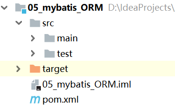		

## 6.1.什么是ORM映射

MyBatis只能自动维护库表”列名“与”属性名“相同时的对应关系，二者不同时无法自动ORM，如下：

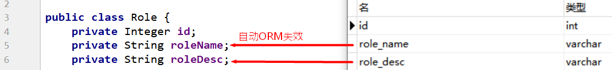

## 6.2.列的别名

在SQL中使用 as 为查询字段添加列别名，以匹配属性名：

```java
    public List<Role> findAll();
```

```xml
    <select id="findAll" resultType="com.qf.pojo.Role" >
        select id, role_name as roleName, role_desc as roleDesc from role
    </select>
```

**思考：** 如果我们的查询很多，都使用别名的话写起来岂不是很麻烦，有没有别的解决办法呢？

## 6.3.结果映射

使用`ResultMap`标签手动映射，解决实体字段和数据表字段不一致的问题

```java
	public List<Role> findAll2();
```

```xml
    <!--
        id:和select查询标签的返回值保持一致
        type: 映射实体的全类名
    -->
    <resultMap id="findAll2ResultMap" type="com.qf.pojo.Role">
        <!--
            描述主键字段的映射关系：
                property：实体类的属性
	            column：数据表字段名称
        -->
        <id property="id" column="id" />

        <!--
            描述非主键字段的映射关系：
                property：实体类的属性
	            column：数据表字段名称
        -->
        <result property="roleName" column="role_name" />
        <result property="roleDesc" column="role_desc" />
    </resultMap>
    <select id="findAll2" resultMap="findAll2ResultMap" >
        select * from role
    </select>
```

# 7.MyBatis的配置文件

拷贝01_mybatis_HelloWorld工程：

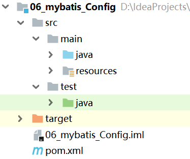		

## 7.1.properties标签

1. 我们一般会把数据库配置信息定义在一个独立的配置文件里面，比如db.properties：

   ```properties
   jdbc.driver=com.mysql.jdbc.Driver
   jdbc.url=jdbc:mysql://127.0.0.1:3306/mybatis?characterEncoding=UTF-8
   jdbc.username=root
   jdbc.password=1111
   ```

   那么我们如何在mybatis的核心配置文件里面加载外部的数据库配置信息呢?

2. 在SqlMapConfig.xml引入数据库配置信息

   ```xml
   <?xml version="1.0" encoding="UTF-8"?>
   <!DOCTYPE configuration PUBLIC "-//mybatis.org//DTD Config 3.0//EN" "http://mybatis.org/dtd/mybatis-3-config.dtd">
   <configuration>
       <!--引入db.properties-->
       <properties resource="db.properties"></properties>
       <environments default="mysql">
           <environment id="mysql">
               <transactionManager type="JDBC"></transactionManager>
               <dataSource type="POOLED">
                   <!--使用${}占位符获取配置信息-->
                   <property name="driver" value="${jdbc.driver}"/>
                   <property name="url" value="${jdbc.url}"/>
                   <property name="username" value="${jdbc.username}"/>
                   <property name="password" value="${jdbc.password}"/>
               </dataSource>
           </environment>
       </environments>
       <mappers>
           <mapper resource="com/qf/dao/UserDao.xml"/>
       </mappers>
   </configuration>
   ```

## 7.2.typeAliases标签

查看mybatis源码可以看到 Mybatis 默认支持的别名：

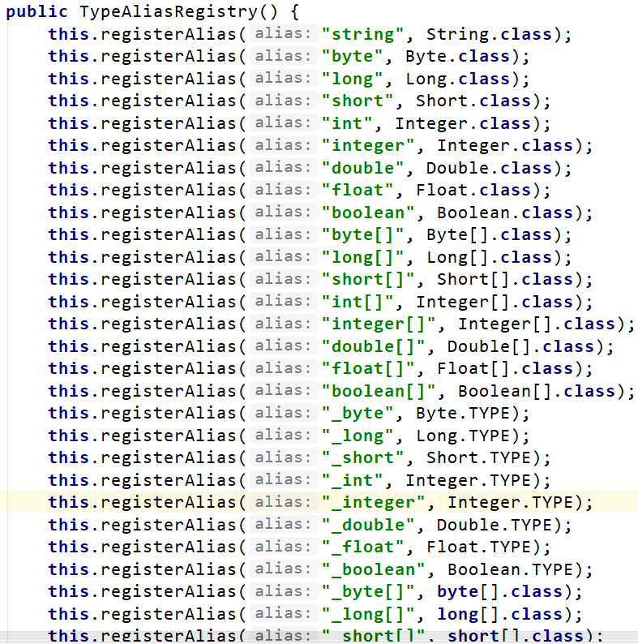	

我们也可以为实体类定义别名，提高书写效率：

1. 定义别名

   ```xml
   <?xml version="1.0" encoding="UTF-8"?>
   <!DOCTYPE configuration PUBLIC "-//mybatis.org//DTD Config 3.0//EN" "http://mybatis.org/dtd/mybatis-3-config.dtd">
   <configuration>
       <properties resource="db.properties"></properties>
       <typeAliases>
           <!--定义单个别名-->
           <!--<typeAlias type="com.qf.pojo.User" alias="User"></typeAlias>-->
           <!--批量定义别名-->
           <package name="com.qf.pojo"></package>
       </typeAliases>
       <environments default="mysql">
           <environment id="mysql">
               <transactionManager type="JDBC"></transactionManager>
               <dataSource type="POOLED">
                   <property name="driver" value="${jdbc.driver}"/>
                   <property name="url" value="${jdbc.url}"/>
                   <property name="username" value="${jdbc.username}"/>
                   <property name="password" value="${jdbc.password}"/>
               </dataSource>
           </environment>
       </environments>
       <mappers>
           <mapper resource="com/qf/dao/UserDao.xml"/>
       </mappers>
   </configuration>
   ```

2. 使用别名

   ```xml
   <?xml version="1.0" encoding="UTF-8"?>
   <!DOCTYPE mapper
           PUBLIC "-//mybatis.org//DTD Mapper 3.0//EN"
           "http://mybatis.org/dtd/mybatis-3-mapper.dtd">
   <mapper namespace="com.qf.dao.UserDao">
       <!--使用别名-->
       <select id="findAll" resultType="User">
           select * from user
       </select>
   </mapper>
   ```

## 7.3.Mappers标签

Mappers标签的作用是用来在核心配置文件里面引入映射文件，引入方式有如下三种：

1. 使用mapper映射文件的路径

   ```xml
       <mappers>
           <mapper resource="com/qf/dao/UserDao.xml"/>
       </mappers>
   ```

2. 使用mapper接口的路径

   ```xml
   <mappers>
       <mapper class="com.qf.dao.UserDao"></mapper>
   </mappers>
   ```

   注意：此种方法要求 mapper 接口名称和 mapper 映射文件名称相同

3. 使用mapper接口的包名批量引入

   ```xml
       <mappers>
           <package name="com.qf.dao"></package>
       </mappers>
   ```

   注意：此种方法要求 mapper 接口名称和 mapper 映射文件名称相同

# 8.MyBatis的关联查询

拷贝06_mybatis_Config工程：

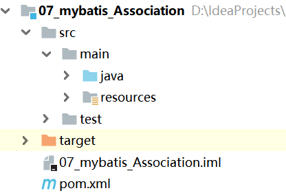	

## 8.1.什么是关联查询

- 实体间的关系（拥有 has、属于 belong）
   * OneToOne：一对一关系（account ←→ user）

  * OneToMany：一对多关系（user ←→ account）

  * ManyToMany：多对多关系（user ←→  role）

- 什么是关联查询

  当访问关系的一方时，如果需要查看与之关联的另一方数据，则必须使用表链接查询，将查询到的另一方数据，保存在本方的属性中
  
- 关联查询的语法

   指定“一方”关系时（对象），使用`< association javaType="" >`

   指定“多方”关系时（集合），使用`< collection ofType="" >`

## 8.2.一对一查询

需求：查询账户信息，关联查询用户信息。

分析：因为一个账户信息只能供某个用户使用，所以从查询账户信息出发关联查询用户信息为一对一查询。

### 8.2.1.pojo

```java
public class Account implements Serializable {

    private Integer id;
    private Integer uid;
    private Double money;
    //加入User类的对象作为Account类的一个属性
    private User user;

    public User getUser() {
        return user;
    }
    public void setUser(User user) {
        this.user = user;
    }

    public Integer getId() {
        return id;
    }

    public void setId(Integer id) {
        this.id = id;
    }

    public Integer getUid() {
        return uid;
    }

    public void setUid(Integer uid) {
        this.uid = uid;
    }

    public Double getMoney() {
        return money;
    }

    public void setMoney(Double money) {
        this.money = money;
    }

    @Override
    public String toString() {
        return "Account{" +
                "id=" + id +
                ", uid=" + uid +
                ", money=" + money +
                ", user=" + user +
                '}';
    }
}
```

### 8.2.2.mapper

```java
public interface AccountDao {
    List<Account> findAll();
}
```

```xml
<?xml version="1.0" encoding="UTF-8"?>
<!DOCTYPE mapper
        PUBLIC "-//mybatis.org//DTD Mapper 3.0//EN"
        "http://mybatis.org/dtd/mybatis-3-mapper.dtd">
<mapper namespace="com.qf.dao.AccountDao">
    <!-- 结果映射 -->
    <resultMap type="account" id="findAllResultMap">
        <id column="aid" property="id"/>
        <result column="uid" property="uid"/>
        <result column="money" property="money"/>
        <!-- 指定关系表中数据的封装规则 -->
        <association property="user" javaType="user">
            <id column="id" property="id"/>
            <result column="username" property="username"/>
            <result column="sex" property="sex"/>
            <result column="birthday" property="birthday"/>
            <result column="address" property="address"/>
        </association>
    </resultMap>
    <select id="findAll" resultMap="findAllResultMap">
        select u.*,a.id as aid,a.uid,a.money from account a,user u where a.uid =u.id;
    </select>
</mapper>
```

### 8.2.3.测试

```java
    @Test
    public void testOneToOne() {
        AccountDao accountDao = sqlSession.getMapper(AccountDao.class);
        List<Account> accountList = accountDao.findAll();
        for (Account ac : accountList) {
            System.out.println(ac);
        }
    }
```

## 8.3.一对多查询

需求：查询所有用户信息及用户关联的账户信息。

分析：用户信息和他的账户信息为一对多关系，并且查询过程中如果用户没有账户信息，此时也要将用户信息查询出来，此时左外连接查询比较合适。

### 8.3.1.pojo

```java
package com.qf.pojo;

import java.io.Serializable;
import java.util.Date;
import java.util.List;

public class User implements Serializable {
    private Integer id;
    private String username;
    private String password;
    private Date birthday;
    private String sex;
    private String address;
    //加入List<Account>存储用户所拥有的账户
    private List<Account> accounts;

    public Integer getId() {
        return id;
    }

    public void setId(Integer id) {
        this.id = id;
    }

    public String getUsername() {
        return username;
    }

    public void setUsername(String username) {
        this.username = username;
    }

    public Date getBirthday() {
        return birthday;
    }

    public void setBirthday(Date birthday) {
        this.birthday = birthday;
    }

    public String getSex() {
        return sex;
    }

    public void setSex(String sex) {
        this.sex = sex;
    }

    public String getAddress() {
        return address;
    }

    public void setAddress(String address) {
        this.address = address;
    }

    public String getPassword() {
        return password;
    }

    public void setPassword(String password) {
        this.password = password;
    }

    public List<Account> getAccounts() {
        return accounts;
    }

    public void setAccounts(List<Account> accounts) {
        this.accounts = accounts;
    }

    @Override
    public String toString() {
        return "User{" +
                "id=" + id +
                ", username='" + username + '\'' +
                ", password='" + password + '\'' +
                ", birthday=" + birthday +
                ", sex='" + sex + '\'' +
                ", address='" + address + '\'' +
                ", accounts=" + accounts +
                '}';
    }
}
```

### 8.3.2.mapper

```java
public interface AccountDao {
    List<Account> findAll();
}
```

```xml
<?xml version="1.0" encoding="UTF-8"?>
<!DOCTYPE mapper
        PUBLIC "-//mybatis.org//DTD Mapper 3.0//EN"
        "http://mybatis.org/dtd/mybatis-3-mapper.dtd">
<mapper namespace="com.qf.dao.UserDao">
    <resultMap type="user" id="findAllResultMap">
        <id column="id" property="id"></id>
        <result column="username" property="username"/>
        <result column="address" property="address"/>
        <result column="sex" property="sex"/>
        <result column="birthday" property="birthday"/>
        <!-- collection 是用于建立一对多中集合属性的对应关系
        ofType 用于指定集合元素的数据类型
        -->
        <collection property="accounts" ofType="account">
            <id column="aid" property="id"/>
            <result column="uid" property="uid"/>
            <result column="money" property="money"/>
        </collection>
    </resultMap>
    <!-- 配置查询所有操作 -->
    <select id="findAll" resultMap="findAllResultMap">
      select u.*,a.id as aid ,a.uid,a.money 
      from user u left join account a on u.id =a.uid
    </select>
</mapper>
```

### 8.3.3.测试

```java
    @Test
    public void testOneToMany() {
        UserDao userDao = sqlSession.getMapper(UserDao.class);
        List<User> userList = userDao.findAll();
        for(User user : userList){
            System.out.println(user);
        }
    }
```

## 8.4.多对多查询

需求：查询角色及角色赋予的用户信息。

分析：一个用户可以拥有多个角色，一个角色也可以赋予多个用户，用户和角色为双向的一对多关系，多对多关系其实我们看成是双向的一对多关系。

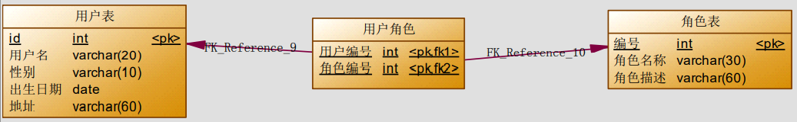

### 8.3.1.pojo

```java
public class Role {
    private Integer id;
    private String roleName;
    private String roleDesc;
    //加入List<User> users存储角色赋予的用户信息
    private List<User> users;

    public Integer getId() {
        return id;
    }

    public void setId(Integer id) {
        this.id = id;
    }

    public String getRoleName() {
        return roleName;
    }

    public void setRoleName(String roleName) {
        this.roleName = roleName;
    }

    public String getRoleDesc() {
        return roleDesc;
    }

    public void setRoleDesc(String roleDesc) {
        this.roleDesc = roleDesc;
    }

    public List<User> getUsers() {
        return users;
    }

    public void setUsers(List<User> users) {
        this.users = users;
    }

    @Override
    public String toString() {
        return "Role{" +
                "id=" + id +
                ", roleName='" + roleName + '\'' +
                ", roleDesc='" + roleDesc + '\'' +
                ", users=" + users +
                '}';
    }
}
```

### 8.3.2.mapper

```java
public interface RoleDao {
    List<Role> findAll();
}
```

```xml
<?xml version="1.0" encoding="UTF-8"?>
<!DOCTYPE mapper
        PUBLIC "-//mybatis.org//DTD Mapper 3.0//EN"
        "http://mybatis.org/dtd/mybatis-3-mapper.dtd">
<mapper namespace="com.qf.dao.RoleDao">
    <!--定义 role 表的 ResultMap-->
    <resultMap id="findAllResultMap" type="Role">
        <id property="id" column="rid"></id>
        <result property="roleName" column="role_name"></result>
        <result property="roleDesc" column="role_desc"></result>
        <collection property="users" ofType="user">
            <id column="id" property="id"></id>
            <result column="username" property="username"></result>
            <result column="address" property="address"></result>
            <result column="sex" property="sex"></result>
            <result column="birthday" property="birthday"></result>
        </collection>
    </resultMap>
    <!--查询所有-->
    <select id="findAll" resultMap="findAllResultMap">
        select r.id as rid,r.role_name,r.role_desc,u.* from role r
        left join user_role ur on r.id = ur.rid
        left join user u on u.id = ur.uid
    </select>
</mapper>
```

### 8.3.3.测试

```java
    @Test
    public void testManyToMany() {
        RoleDao roleDao = sqlSession.getMapper(RoleDao.class);
        List<Role> roleList = roleDao.findAll();
        for(Role role : roleList){
            System.out.println(role);
        }
    }
```

# 9.MyBatis的延迟加载

创建工程：

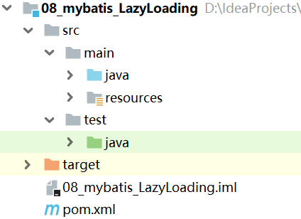	

## 9.1.什么是延迟加载？

开启延迟加载后，在真正使用数据的时候才发起级联查询，不用的时候不查询。

## 9.2.mapper

```java
public interface UserDao {
    public List<User> findAll();
}
```

```xml
<?xml version="1.0" encoding="UTF-8"?>
<!DOCTYPE mapper
        PUBLIC "-//mybatis.org//DTD Mapper 3.0//EN"
        "http://mybatis.org/dtd/mybatis-3-mapper.dtd">
<mapper namespace="com.qf.dao.UserDao">
    <resultMap type="User" id="findAllResultMap">
        <id column="id" property="id"></id>
        <result column="username" property="username"/>
        <result column="address" property="address"/>
        <result column="sex" property="sex"/>
        <result column="birthday" property="birthday"/>
         <!--
          property：属性名
          ofType：泛型
          select： 要调用的 select 映射的 id
          column ： 传递给 select 映射的参数
          fetchType="lazy"：懒加载
         -->
        <collection property="accounts" ofType="Account"
                    select="com.qf.dao.AccountDao.findAccountById" column="id">	
        </collection>
    </resultMap>

    <select id="findAll" resultMap="findAllResultMap">
      select * from user
    </select>
</mapper>
```

```xml
<?xml version="1.0" encoding="UTF-8"?>
<!DOCTYPE mapper
        PUBLIC "-//mybatis.org//DTD Mapper 3.0//EN"
        "http://mybatis.org/dtd/mybatis-3-mapper.dtd">
<mapper namespace="com.qf.dao.AccountDao">
    <select id="findAccountById" resultType="account">
        select * from account where uid = #{id}
    </select>
</mapper>
```

## 9.3.测试

```java
    @Test
    public void testFindAll() {
        UserDao userDao = sqlSession.getMapper(UserDao.class);
        List<User> userList = userDao.findAll();
        for(User user : userList){
            System.out.println(user.getUsername());//不查询account
            System.out.println(user.getAccounts());//查询account
        }
    }
```

# 10.MyBatis的动态SQL

创建工程：

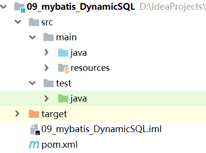		

## 10.1.什么是动态SQL?

MyBatis的映射文件中支持在基础SQL上添加一些逻辑操作，并动态拼接成完整的SQL之后再执行，以达到SQL复用、简化编程的效果。

## 10.2.if标签

我们根据实体类的不同取值，使用不同的SQL语句来进行查询。比如在id如果不为空时可以根据 id查询，如果username不同空时还要加入用户名作为条件。这种情况在我们的多条件组合查询中经常会碰到。

- mapper接口

  ```java
  public interface UserDao {
  
      //复杂条件查询
      public List<User> findByUser(User user);
  }
  ```

- mapper映射文件

  ```xml
  <?xml version="1.0" encoding="UTF-8"?>
  <!DOCTYPE mapper
          PUBLIC "-//mybatis.org//DTD Mapper 3.0//EN"
          "http://mybatis.org/dtd/mybatis-3-mapper.dtd">
  <mapper namespace="com.qf.dao.UserDao">
      <!--使用别名-->
      <select id="findByUser" resultType="User">
          select * from user where 1=1
          <if test="username!=null and username != ''">
              and username=#{username}
          </if>
          <if test="birthday!=null">
              and birthday=#{birthday}
          </if>
          <if test="sex!=null and sex != ''">
              and sex=#{sex}
          </if>
          <if test="address!=null and address != ''">
              and address=#{address}
          </if>
      </select>
  </mapper>
  ```

- 测试

  ```java
      @Test
      public void testFindAll(){
          UserDao userDao = sqlSession.getMapper(UserDao.class);
          User user = new User();
          user.setSex("男");
          user.setAddress("香港");
          List<User> userList = userDao.findByUser(user);
          for(User u : userList){
              System.out.println(u);
          }
      }
  ```

## 10.3.where标签

为了简化上面where 1=1的条件拼装，我们可以使用where标签将if标签代码块包起来，将1=1条件去掉。

若查询条件的开头为 “AND” 或 “OR”，*where* 标签会将它们去除。

- mapper映射文件

  ```xml
  <?xml version="1.0" encoding="UTF-8"?>
  <!DOCTYPE mapper
          PUBLIC "-//mybatis.org//DTD Mapper 3.0//EN"
          "http://mybatis.org/dtd/mybatis-3-mapper.dtd">
  <mapper namespace="com.qf.dao.UserDao">
      <select id="findByUser" resultType="User">
          select * from user
          <!--where标签将if标签代码块包起来去掉开头 “AND” 或 “OR”-->
          <where>
              <if test="username!=null and username != ''">
                  and username=#{username}
              </if>
              <if test="birthday!=null">
                  and birthday=#{birthday}
              </if>
              <if test="sex!=null and sex != ''">
                  and sex=#{sex}
              </if>
              <if test="address!=null and address != ''">
                  and address=#{address}
              </if>
          </where>
      </select>
  </mapper>
  ```

## 10.4.set标签

set标签用于动态包含需要更新的列，并会删掉额外的逗号

- mapper

  ```java
  public void updateByUser(User user);
  ```

  ```xml
      <update id="updateByUser" parameterType="user">
          update user
          <set>
              <if test="username!=null and username != '' ">
                  username=#{username},
              </if>
              <if test="birthday!=null">
                  birthday=#{birthday},
              </if>
              <if test="sex!=null and username != '' ">
                  sex=#{sex},
              </if>
              <if test="address!=null and username != '' ">
                  address=#{address},
              </if>
          </set>
          where id=#{id}
      </update>
  ```

- 测试

  ```java
      @Test
      public void testUpdateByUser(){
          UserDao userDao = sqlSession.getMapper(UserDao.class);
          User user = new User();
          user.setId(50);
          user.setBirthday(new Date());
          user.setAddress("加拿大");
          userDao.updateByUser(user);
      }
  ```

## 10.5.trim标签

trim标签可以代替where标签、set标签

- mapper

  ```
      //复杂条件查询
      public List<User> findByUser2(User user);
      //修改
      public void updateByUser2(User user);
  ```

  ```xml
      <select id="findByUser2" resultType="User">
          select * from user
          <!-- 增加WHERE前缀，忽略AND前缀 -->
          <trim prefix="WHERE" prefixOverrides="AND|OR">
              <if test="username!=null and username != ''">
                  and username=#{username}
              </if>
              <if test="birthday!=null">
                  and birthday=#{birthday}
              </if>
              <if test="sex!=null and sex != ''">
                  and sex=#{sex}
              </if>
              <if test="address!=null and address != ''">
                  and address=#{address}
              </if>
          </trim>
      </select>
      <update id="updateByUser2" parameterType="User">
          update user
          <!-- 增加SET前缀，忽略，后缀 -->
          <trim prefix="SET" suffixOverrides=",">
              <if test="birthday!=null">
                  birthday=#{birthday},
              </if>
              <if test="sex!=null and username != '' ">
                  sex=#{sex},
              </if>
              <if test="address!=null and username != '' ">
                  address=#{address},
              </if>
          </trim>
          where id=#{id}
      </update>
  ```

## 10.6.foreach标签

foreach标签的常见使用场景是集合进行遍历

- mapper

  ```java
      //批量删除
      public void deleteUserByIds(@Param("ids") List<Integer> ids);
  ```

  ```xml
      <delete id="deleteUserByIds" parameterType="List">
          delete from user where id in
          <!--
              collection：取值list、array、map、@Param("keyName")、对象的属性名
              item：循环取出的具体对象
              open：起始符
              separator：分隔符
              close：结束符
          -->
          <foreach collection="ids" item="id" open="(" close=")" separator=",">
              #{id}
          </foreach>
      </delete>
  ```

- 测试

  ```java
      @Test
      public void testDeleteUserByIds(){
          UserDao userDao = sqlSession.getMapper(UserDao.class);
          List<Integer> ids = new ArrayList();
          ids.add(50);
          ids.add(64);
          ids.add(67);
          userDao.deleteUserByIds(ids);
      }
  ```

## 10.7.sql标签

sql元素标签用来定义可重复使用的SQL代码片段，使用时只需要用include元素标签引用即可

- mapper

  ```java
      //复杂条件查询
      public List<User> findByUser3(User user);
  ```

  ```xml
      <!-- 定义SQL片段 -->
      <sql id="query_user_where">
          <if test="username!=null and username != ''">
              and username=#{username}
          </if>
          <if test="birthday!=null">
              and birthday=#{birthday}
          </if>
          <if test="sex!=null and sex != ''">
              and sex=#{sex}
          </if>
          <if test="address!=null and address != ''">
              and address=#{address}
          </if>
      </sql>
      <select id="findByUser3" resultType="User">
          select * from user
          <where>
              <include refid="query_user_where"></include>
          </where>
      </select>
  ```

- 测试

  ```java
      @Test
      public void testFindAll3(){
          UserDao userDao = sqlSession.getMapper(UserDao.class);
          User user = new User();
          user.setAddress("香港");
          user.setUsername("刘德华");
          List<User> userList = userDao.findByUser3(user);
          for(User u : userList){
              System.out.println(u);
          }
      }
  ```

# 11.MyBatis的缓存

创建工程：

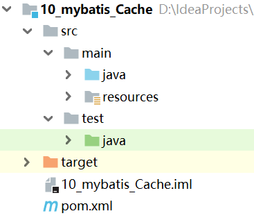	

## 11.1缓存介绍

- 为什么使用缓存？

  首次访问时，查询数据库，并将数据存储到内存中；再次访问时直接访问缓存，减少IO、硬盘读写次数、提高效率

- Mybatis中的一级缓存和二级缓存？

  - 一级缓存:

    它指的是mybatis中的SqlSession对象的缓存。当我们执行完查询之后，查询的结果会同时存在在SqlSession为我们提供的一块区域中。当我们再次查询同样的数据，mybatis会先去SqlSession中查询是否有，有的话直接拿出来使用。当SqlSession对象消失时，Mybatis的一级缓存也就消失了。

  - 二级缓存：

    它指的是Mybatis中SqlSessionFactory对象的缓存，由同一个SqlSessioFactory对象创建的SqlSession共享其缓存。

## 11.2.一级缓存

### 11.2.1.mapper

```java
public interface UserDao {
    //根据id查询用户信息
    public User findUserById(Integer id);
}
```

```xml
<?xml version="1.0" encoding="UTF-8"?>
<!DOCTYPE mapper
        PUBLIC "-//mybatis.org//DTD Mapper 3.0//EN"
        "http://mybatis.org/dtd/mybatis-3-mapper.dtd">
<mapper namespace="com.qf.dao.UserDao">
    <select id="findUserById" resultType="User" parameterType="int">
        select * from user where id=#{id}
    </select>
</mapper>
```

### 11.2.2.测试一级缓存

```java
    @Test
    public void testFindUserById() throws Exception{
        SqlSession sqlSession1 = sqlSessionFactory.openSession();
        UserDao userDao = sqlSession1.getMapper(UserDao.class);
        User user1 = userDao.findUserById(41);//执行查询
        System.out.println("第一次查询:" + user1);
        User user2 = userDao.findUserById(41);//不执行查询
        System.out.println("第二次查询:" + user2);

        SqlSession sqlSession2 = sqlSessionFactory.openSession();
        userDao = sqlSession2.getMapper(UserDao.class);
        User user3 = userDao.findUserById(41);//执行查询
        System.out.println("第三次查询:" + user1);
    }
```

### 11.2.3.一级缓存的分析

一级缓存是SqlSession范围的缓存，当调用SqlSession的commit()，close()等方法时，就会清空一级缓存。

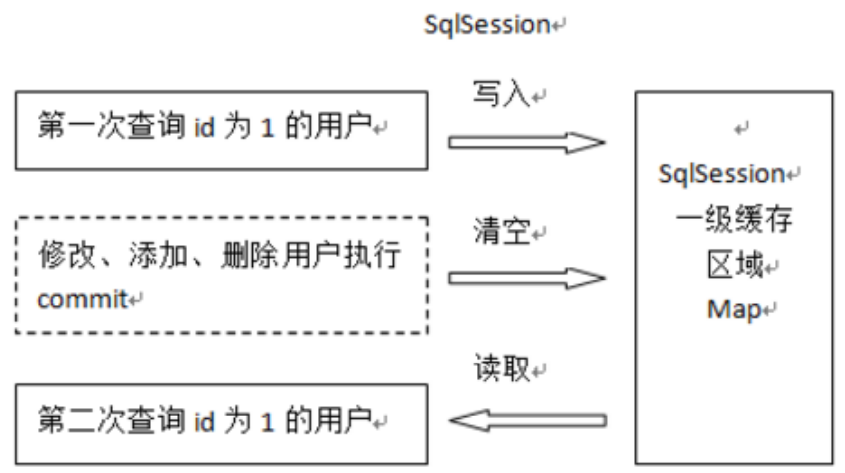	

1. 第一次发起查询用户id为 1 的用户信息，先去找缓存中是否有id为 1 的用户信息，如果没有，从数据库查询用户信息。 得到用户信息，将用户信息存储到一级缓存中。 

2. 如果sqlSession去执行 commit操作（执行插入、更新、删除），清空 SqlSession 中的一级缓存，这样做的目的为了让缓存中存储的是最新的信息，**避免脏读**。 

3. 第二次发起查询用户id为1的用户信息，先去找缓存中是否有id为1的用户信息，缓存中有，直接从缓存中获取用户信息。

### 11.2.4.测试清空一级缓存

```java
    @Test
    public void testFindUserById() throws Exception{
        UserDao userDao = sqlSession.getMapper(UserDao.class);
        User user1 = userDao.findUserById(41);//执行查询
        System.out.println("第一次查询:" + user1);
        User user2 = userDao.findUserById(41);//不执行查询
        System.out.println("第二次查询:" + user2);
        sqlSession.commit();
        
        User user3 = userDao.findUserById(41);//执行查询
        System.out.println("第三次查询:" + user1);
    }
```

## 11.3.二级缓存

### 11.3.1.pojo

注意：当我们在使用二级缓存时，所缓存的类一定要实现java.io.Serializable接口，这种就可以使用序列化方式来保存对象。

```java
public class User implements Serializable {

    private Integer id;
    private String username;
    private String password;
    private Date birthday;
    private String sex;
    private String address;
    //set get... ...
}    
```

### 11.3.2.开启二级缓存

1. 在SqlMapConfig.xml 文件开启二级缓存

   ```xml
   <settings>
       <!-- 开启二级缓存的支持 -->
       <setting name="cacheEnabled" value="true"/>
   </settings>
   ```

2. 配置相关的Mapper映射文件

   ```xml
   <mapper namespace="com.qf.dao.UserDao">
       <!-- 开启二级缓存的支持 -->
       <cache></cache>
   ```

3. 配置statement

   ```xml
       <select id="findUserById" resultType="User" parameterType="int" useCache="true">
           select * from user where id=#{id}
       </select>
   ```

### 11.3.3.测试二级缓存

```java
    @Test
    public void testSecondUserById(){
        SqlSession sqlSession1 = sqlSessionFactory.openSession();
        UserDao userDao = sqlSession1.getMapper(UserDao.class);
        User user1 = userDao.findUserById(41);//执行查询
        System.out.println("第一次查询:" + user1);
        sqlSession1.close();//二级缓存在sqlSession.commit()或者sqlSession.close()之后生效

        SqlSession sqlSession2 = sqlSessionFactory.openSession();
        UserDao userDao2 = sqlSession2.getMapper(UserDao.class);
        User user2 = userDao2.findUserById(41);//不执行查询
        System.out.println("第二次查询:" + user2);
    }
```

### 11.3.4.二级缓存分析

二级缓存是mapper映射级别的缓存，多个SqlSession去操作同一个Mapper映射的sql语句，多个SqlSession可以共用二级缓存，二级缓存是跨SqlSession的。

二级缓存结构图:

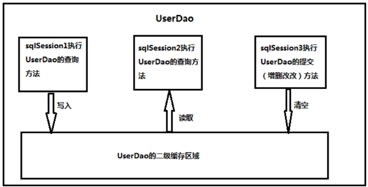 

### 11.3.5.测试清空一级缓存

```java
    @Test
    public void testSecondUserById(){
        SqlSession sqlSession1 = sqlSessionFactory.openSession();
        UserDao userDao = sqlSession1.getMapper(UserDao.class);
        User user1 = userDao.findUserById(43);//执行查询
        System.out.println("第一次查询:" + user1);
        sqlSession1.commit();

        SqlSession sqlSession3 = sqlSessionFactory.openSession();
        UserDao userDao3 = sqlSession3.getMapper(UserDao.class);
        userDao3.deleteUserById(41);
        sqlSession3.commit();

        SqlSession sqlSession2 = sqlSessionFactory.openSession();
        UserDao userDao2 = sqlSession2.getMapper(UserDao.class);
        User user2 = userDao2.findUserById(43);////不执行查询
        System.out.println("第二次查询:" + user2);
        sqlSession2.commit();
        sqlSession2.close();
    }
```

# 12.MyBatis的注解开发

创建工程：

	

## 12.1.注解开发的缺点

MyBatis可以在接口中直接添加MyBatis注解，完成CRUD。

但注解模式属于硬编码到.java文件中，失去了使用配置文件外部修改的优势，可结合需求选用。

## 12.2.mapper

```java
public interface UserDao {
    /**
     * 查询所有用户
     * @return
     */
    @Select("select * from user")
    public List<User> findAll();

    /**
     * 保存操作
     * @param user
     * @return
     */
    @Insert("insert into user(username,sex,birthday,address)values(#{username},“+
            "#{sex},#{birthday},#{address})")
    @SelectKey(keyColumn="id",keyProperty="id",resultType=Integer.class,before =
            false,statement = { "select last_insert_id()" })
    int saveUser(User user);
    /**
     * 更新操作
     * @param user
     * @return
     */
    @Update("update user set username=#{username},address=#{address}," +
            "sex=#{sex},birthday=#{birthday} where id =#{id} ")
    void updateUser(User user);
    /**
     * 删除用户
     * @param id
     * @return
     */
    @Delete("delete from user where id = #{id} ")
    void deleteUser(Integer id);
    /**
     * 查询使用聚合函数
     * @return
     */
    @Select("select count(*) from user ")
    int findTotal();
    /**
     * 根据id查询用户
     * @return
     */
    @Select("select * from user where id = #{id} ")
    public User findById(Integer id);
    /**
     * 一对多
     * @return
     */
    @Results(id="resultMap",
            value= {
                    @Result(id=true,column="id",property="id"),
                    @Result(column="username",property="username"),
                    @Result(column="sex",property="sex"),
                    @Result(column="address",property="address"),
                    @Result(column="birthday",property="birthday"),
                    @Result(column="id",property="accounts",
                            many=@Many(
                                    select="com.qf.dao.AccountDao.findByuId",
                                    fetchType= FetchType.LAZY
                            )
                    )
            })
    @Select("select * from user")
    public List<User> findAll2();
}
```

```java
public interface AccountDao {
    @Results(id="accountMap",
        value= {
                @Result(id=true,column="id",property="id"),
                @Result(column="uid",property="uid"),
                @Result(column="money",property="money"),
                @Result(column="uid",
                        property="user",
                        one=@One(select="com.qf.dao.UserDao.findById",
                                fetchType= FetchType.LAZY)
                )
        })
    @Select("select * from account")
    List<Account> findAll();

    @Select("select * from account where uid = #{uid} ")
    List<Account> findByuId(Integer id);
}
```

## 12.3.pojo

```java
public class User implements Serializable {
    private Integer id;
    private String username;
    private String password;
    private Date birthday;
    private String sex;
    private String address;
    private List<Account> accounts;
    //一对多关系映射
    private List<Account> accounts;
	// get set toString方法省略
}	
```

```java
public class Account implements Serializable {
    private Integer id;
    private Integer uid;
    private Double money;
    //一对一关系映射
    private User user;
    // get set toString方法省略
}
```

## 12.4.测试

```java
    @Test
    public void testFindAll() throws Exception{
        UserDao userDao = sqlSession.getMapper(UserDao.class);
        List<User> userList = userDao.findAll2();
        for(User user : userList){
            System.out.println(user);
        }
    }
```

